## Projects

<a href="TexasTech_report_2026.pdf">Racial Preferences at a Texas Medical School</a>

 <em>working paper</em> (2026)

* <a href="UTSouthwestern_report.pdf">UT Southwestern Medical School Admissions Analysis</a> 
* <a href="UTDell_report.pdf">UT Dell Medical School Admissions Analysis</a> 
* <a href="https://www.realclearpolitics.com/articles/2026/04/16/higher_ed_is_hiding_racial_discrimination_154041.html" style="color: #8B0000;">Higher Ed is Hiding Racial Discrimination</a>, <em>Real Clear Politics</em> op-ed (2026)

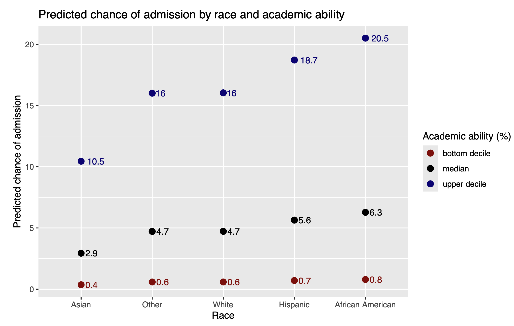

<a href="https://arxiv.org/pdf/2408.07765">Heterogenous Treatment Effect Estimation Under Noncompliance in The Illinois Workplace Wellness Study with Bayesian Tree Ensembles</a>

with J Fisher and S Deshpande, <em>submitted</em> (2025)

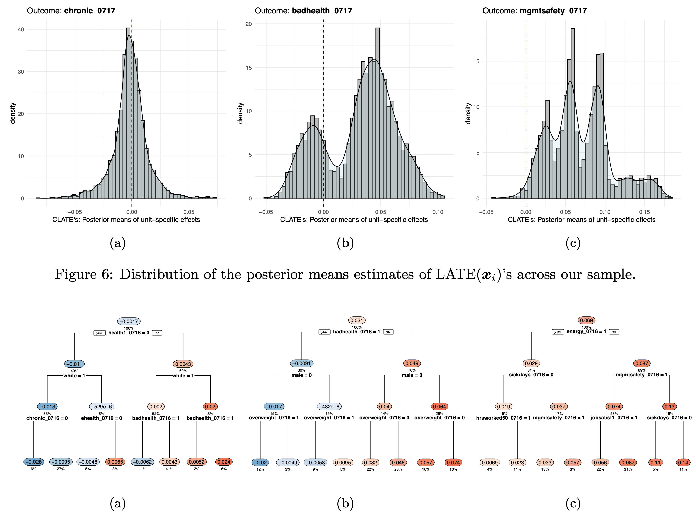

<a href="https://papers.ssrn.com/sol3/papers.cfm?abstract_id=4929341">Financial Literacy and Financial Well-being</a>

with M Doh and R Puelz, <em>submitted</em> (2024)

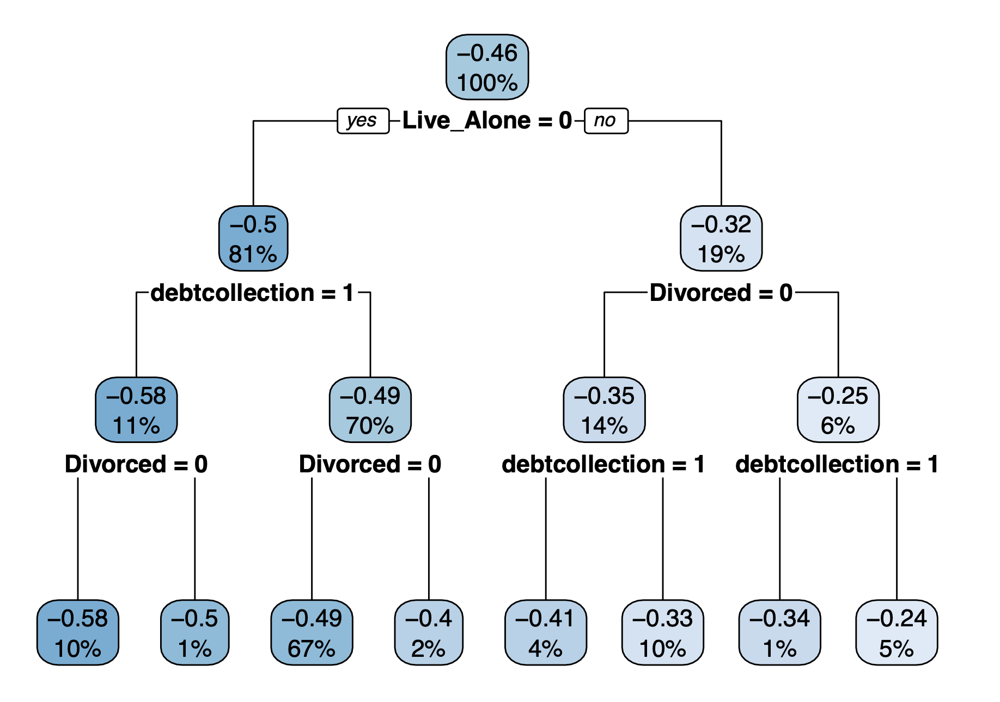

<a href="https://www.frontiersin.org/articles/10.3389/fepid.2024.1389617/full?&utm_source=Email_to_authors_&utm_medium=Email&utm_content=T1_11.5e1_author&utm_campaign=Email_publication&field=&journalName=Frontiers_in_Epidemiology&id=1389617">The Disutility of Compartmental Model Forecasts during the COVID-19 Pandemic</a>

with T Sudhakar, A Bhansali, and J Walkington, <em>Frontiers in Epidemiology</em> (2024)

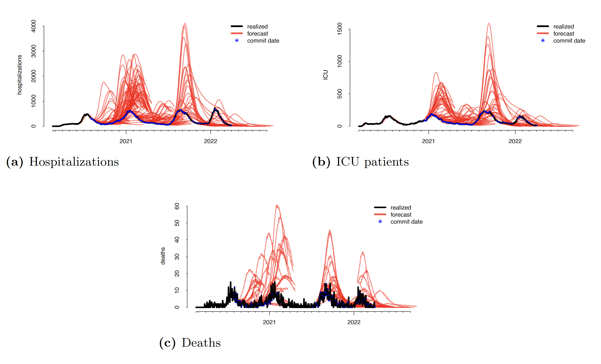

<a href="https://www.jacc.org/doi/abs/10.1016/S0735-1097%2824%2903572-1">Identification of High-risk Variables for Pediatric Patients with Anomalous Aortic Origin of the Right Coronary using Statistical Modeling</a>

with C Puelz, D Reaves-O'Neal, and S Molossi, <em>Journal of the American College of Cardiology</em> (2024)

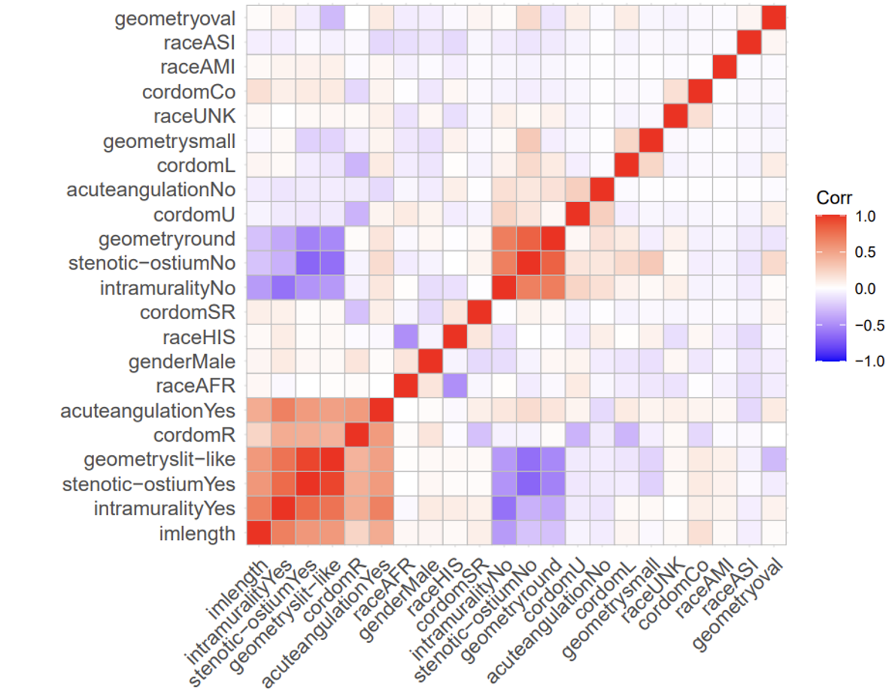

<a href="https://arxiv.org/pdf/1910.10862.pdf">A Graph-Theoretic Approach to Randomization Tests of Causal Effects Under General Interference</a>

with G Basse, A Feller, and P Toulis, <em>Journal of the Royal Statistical Society, Series B</em> (2022)

* <a href="https://github.com/dpuelz/CliqueRT/blob/master/README.md">R package</a> under development. 
* <em>Chicago Booth Review</em> <a href="https://review.chicagobooth.edu/economics/2021/video/how-companies-can-run-more-informative-experiments">video</a> and <a href="https://review.chicagobooth.edu/strategy/2020/article/how-improve-randomized-trials">article</a>.

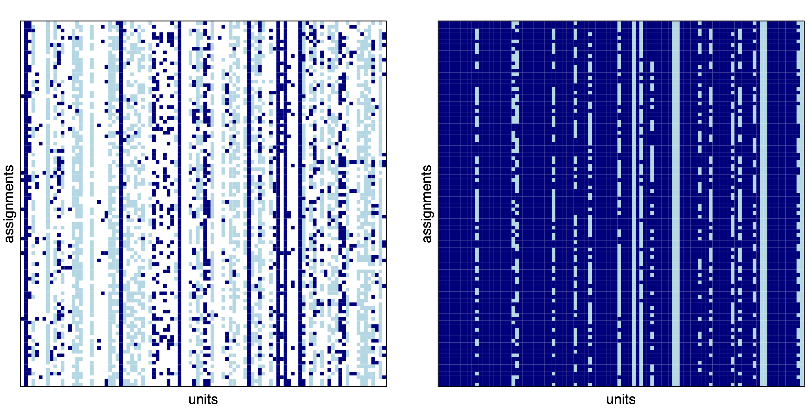

<a href="https://papers.ssrn.com/sol3/papers.cfm?abstract_id=3302978">Financial Literacy and Perceived Economic Outcomes</a>

with R Puelz, <em>Statistics and Public Policy</em> (2022)

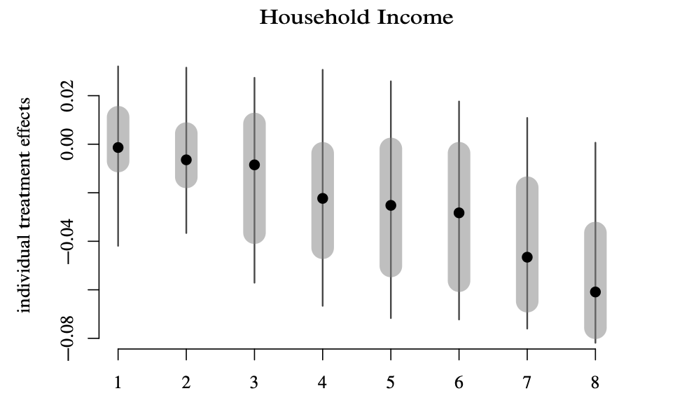

<a href="https://projecteuclid.org/journals/bayesian-analysis/advance-publication/A-Symmetric-Prior-for-Multinomial-Probit-Models/10.1214/20-BA1233.full">A Symmetric Prior for Multinomial Probit Models</a>

with LH Burgette and PR Hahn, <em>Bayesian Analysis</em> (2021)

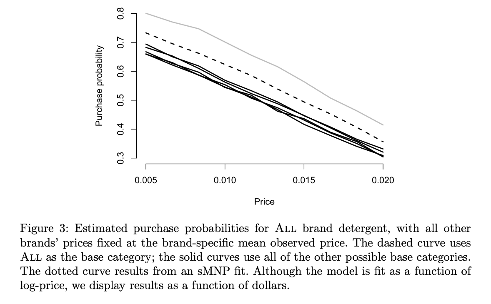

<a href="https://projecteuclid.org/journals/annals-of-applied-statistics/volume-14/issue-4/Monotonic-effects-of-characteristics-on-returns/10.1214/20-AOAS1351.short">Monotonic Effects of Characteristics on Returns</a>

with J Fisher and C Carvalho, <em>Annals of Applied Statistics</em> (2020)

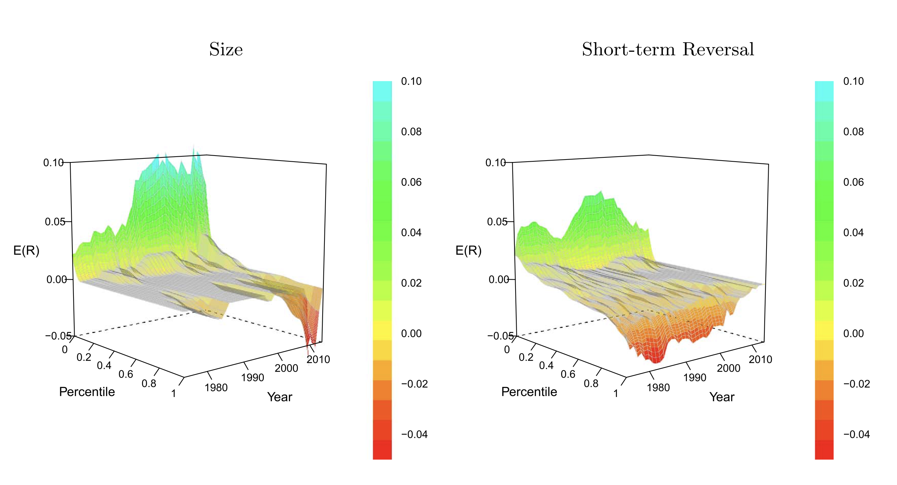

<a href="https://rapidreviewscovid19.mitpress.mit.edu/pub/3mbutnjm/release/2">Review of: "Firearm Purchasing and Firearm Violence in the First Months of the Coronavirus Pandemic in the United States"</a>

with J Fisher, <em>Rapid Reviews: COVID-19</em> (2020)

<a href="https://onlinelibrary.wiley.com/doi/full/10.1002/asmb.2483">Portfolio Selection for Individual Passive Investing</a>

with PR Hahn and C Carvalho, <em>Applied Stochastic Models in Business and Industry</em> (2019)

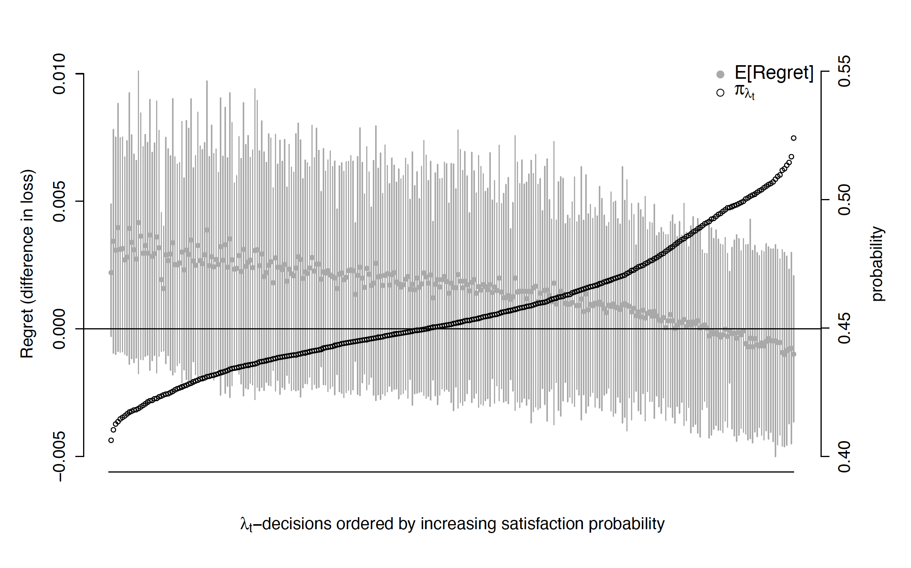

<a href="https://projecteuclid.org/euclid.ba/1484103680">Regularization and Confounding in Linear Regression for Treatment Effect Estimation</a>

with J He, PR Hahn, and C Carvalho, <em>Bayesian Analysis</em> (2018)

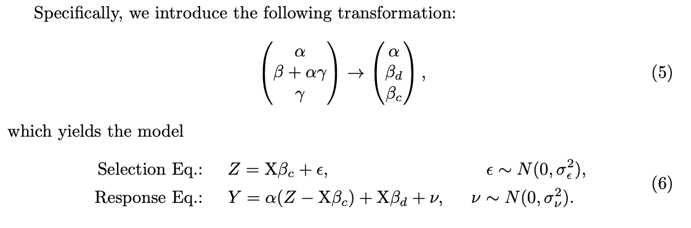

<a href="https://repositories.lib.utexas.edu/bitstream/handle/2152/65998/PUELZ-DISSERTATION-2018.pdf">Regularization in Econometrics and Finance</a>

dissertation (2018)

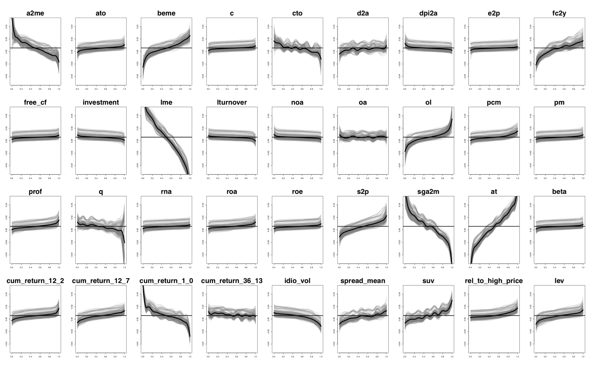

<a href="https://projecteuclid.org/euclid.ba/1488855633#abstract">Variable Selection in Seemingly Unrelated Regressions with Random Predictors</a>

with PR Hahn and C Carvalho, <em>Bayesian Analysis</em> (2017)

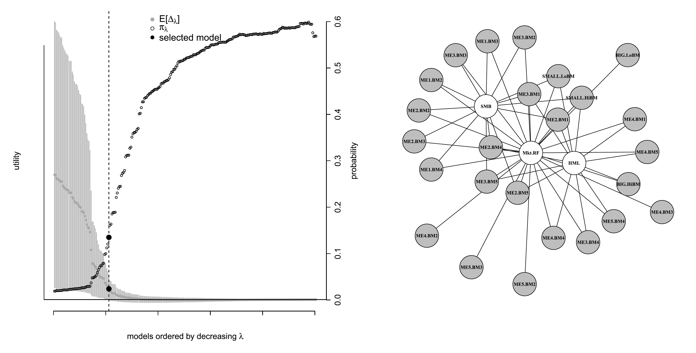

## Talks

<a href="jobtalk.pdf">Randomization, Machine Learning, and Everything in Between</a>

The University of Austin (2024) - New College of Florida (2024)

Randomization Tests of Causal Effects Under General Interference

(<a href="lunch_seminar.pdf">slides</a> + <a href="https://www.youtube.com/watch?v=hLmAXgVdQlc&t=899s">video</a>)

Salem Center Causal Inference Seminar - UT Austin (2022) / Society for Political Methodology Annual Meeting - NYU (2021) / International Indian Statistical Association (2021) / Arizona State University (2020) / The University of Chicago Booth School of Business - Econometrics and Statistics Seminar (2019) / Atlantic Causal Inference Conference - McGill University (2019) / International Conference on the Design of Experiments - University of Memphis (2019) / Society for Political Methodology Annual Meeting - MIT (2019) / Design and Analysis of Experiments - UT Knoxville (2019) / Advances with Field Experiments - Chicago Economics (2019)

<a href="RPWorkshop.pdf">A Flexible Model for Returns.</a>

Statistical Methods in Finance (2021) / Seminar on Bayesian Inference in Econometrics and Statistics - Brown University (2019) / Eastern Asia ISBA Conference - Kobe University (Japan, 2019) / The University of Chicago Booth School of Business - Research Workshop (2018)

<a href="ISBA2018.pdf">Posterior Summarization in Finance.</a>

International Society for Bayesian Analysis World Meeting - University of Edinburgh (2018)

<a href="SBIES2017.pdf">Regret-based Selection.</a>

Seminar on Bayesian Inference in Econometrics and Statistics - Washington University in St. Louis (2017)

<a href="GSFeb2016.pdf">Decoupling Shrinkage and Selection.</a>

Goldman Sachs. New York, NY (2016)

<a href="SBIESPresentation.pdf">The ETF Tangency Portfolio.</a>

Seminar on Bayesian Inference in Econometrics and Statistics - Washington University in St. Louis (2015)

<a href="TimeSeriesBABPresentation.pdf">Betting Against β: A State-space Approach.</a>

UT McCombs. Austin, TX (2014)

<a href="defense.pdf">Dissertation Defense.</a>

## Teaching

Quantitative Reasoning I and II (UATX)

Fall '24 + Winter '25

Two-part sequence in the Intellectual Foundations program at The University of Austin.

Intro to Machine Learning

Summer '21,'22,'23,'24 + Fall '23,'24: Working Professionals program

This is the second half of a two-part introductory course on predictive modeling for students in the MS program in Business Analytics at UT Austin. In the first half of the course, you learned about predictive models for labeled data (i.e. regression, or supervised learning). In the second half, we will turn to the following topics:  
- a refresher of some important probability concepts. 
- exploratory data analysis. 
- resampling methods for uncertainty quantification. 
- unsupervised learning, i.e. learning to model structure in unlabeled data.  
The course is intended as an overview, rather than an in-depth treatment of any particular topic. We will move fast and cover a lot, but will focus on practical applications rather than theory.

Policy Research Laboratory

Fall '21,'22,'23,'24

The <a href="https://sites.google.com/view/policyresearchlaboratory/about">Policy Research Laboratory</a> (PRL) is offered in the McCombs School of Business. Students will take a semester-long course in statistics, econometrics, and data science to learn the tools necessary for policy and social science research. In parallel, the students will apply these tools to real-world data and answer crucial policy questions. Policy research is important, and appropriately using data, cutting-edge statistical tools and remaining skeptical are equally important. Students can expect to leave this class with a deep understanding of policy questions and a toolbox for evaluating them.  
After the semester, the research assistantship begins. Students will be matched with policy projects within the center and/or with faculty. They will have the opportunity to immediately use their skills learned in PRL to work on exciting research that culminates in journal submission and publication. The research projects will be high impact and could elucidate cause-and-effect and tradeoffs of policies being discussed in the global arena.

Statistics for Executives

Fall '23

The core statistics course for the Executive MBA program at UT Austin.

Data Science for Economics & Policy

Spring '23

This is a semester-long course in statistics and data science to learn the tools necessary for policy, economics, and social science research. In parallel, students will apply these tools to real-world data and answer crucial policy questions.

Machine Learning in Finance

Spring '22

PhD class at the University of Texas at Austin open to statistics, IROM, economics, and finance graduate students. Topics covered include modeling stock return panel data with supervised learning methods, navigating the bias-variance tradeoff with low signal-to-noise data, causal machine learning, and regularization-induced confounding. <a href="https://github.com/dpuelz/Machine-Learning-in-Finance">Here is the course website</a>.

<a href="MLLecture.pdf">Machine Learning in Finance.</a>

Quantitative Investing Strategies. Spring 2016.

<a href="BeautyandTeaching.pdf">Beauty and Teaching.</a>

Pedagogy. Spring 2016.

<a href="DavidZackQuantPortfolio.pdf">Mean-variance Portfolios.</a>

Quantitative Investing Strategies. Spring 2016.

<a href="InvestmentStrategiesBABlecture.pdf">Betting Against β and The CAPM.</a>

Quantitative Investing Strategies. Spring 2015.

